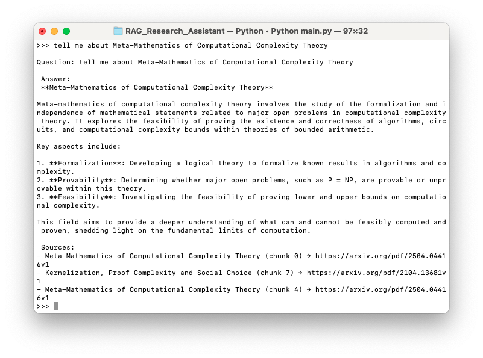

This is a Research Assistant project. It retrieves papers from [arxiv.org](arxiv.org) on your topic of choice and then helps you
better understand it by answering questions.

Key technologies: *Langchain*, *Groq*, *Chroma*, *SQLite*, *huggingface*.

The project consists of two main parts: saving papers to a vector database and retrieving information from the database.

Here is how we store the papers:
* You give a topic you are interested in (e.g. Machine Learning, Algorithm Complexity, Astrophysics of Galaxies).
* Using an LLM, we get an appropriate category from [these caterogies](https://arxiv.org/category_taxonomy). 
* Then we make a request to the API, retrieve papers metadata and store it in an SQLite database.

* Next, we access the actual papers texts and clean them from excess information. The clean texts are then divided into chunks
and transformed into embeddings. We store the embeddings in a Chroma database.

The second part is where a user asks a question:
* We embed the question and search Chroma db for related information.
* To improve accuracy of the answer, we use reranking on top k relevant chunks.
* Final chunks are passed to an LLM, which in turn transforms them into a human-friendly answer. Additionally, we
returned top 3 relevant chunks with the links to pdfs. This will help better understand where the answers came from.

Answer example for a question in the category "Proof Assistance":



To run this project, you must create an *.env* file and add a `GROQ_API_KEY` to it.

To run it in *docker container*, use the following commands:

```
docker-compose up --build

docker-compose run --rm --service-ports app python main.py

```
